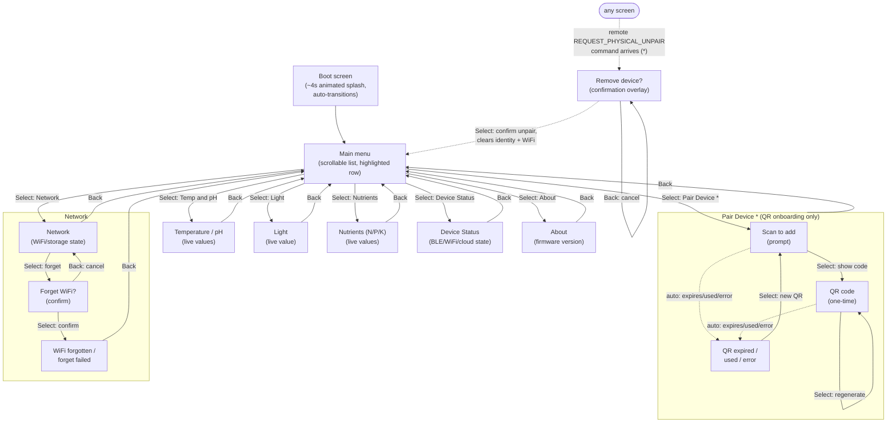

# OLED screen navigation

Applies to the `esp32-s3-dev-qr-onboarding-demo` and `esp32-s3-dev-local-oled-demo`
PlatformIO environments (the only two that define `ALGAGUARD_ENABLE_LOCAL_MOCK_SENSORS`).
The local-oled-demo profile has no QR pairing, so it has no "Pair Device" item
or Physical-Unpair overlay -- both are specific to `ALGAGUARD_ENABLE_QR_ONBOARDING`.

## Buttons

Four hardware buttons, active-low, 35ms debounce, short-press only:

| Button | GPIO | Role |
|---|---|---|
| Up | 4 | Move the highlight up (main menu only) |
| Down | 5 | Move the highlight down (main menu only) |
| Select | 6 | Enter the highlighted screen / act |
| Back | 7 | Return to the main menu (context-dependent inside sub-flows) |

## Flowchart

`*` The Physical-Unpair overlay pre-empts *every* other screen the instant a
`REQUEST_PHYSICAL_UNPAIR` MQTT command arrives (only on the QR-onboarding
build, since it needs device identity/telemetry) -- Up/Down do nothing while
it's showing, Select confirms (wipes identity, clears WiFi, returns to the
main menu), Back cancels and returns to whatever was showing before.

## Screen-by-screen input reference

| Screen | Up / Down | Select | Back |
|---|---|---|---|
| Main menu | Move highlight (wraps) | Enter highlighted item | *(no-op, already at the top)* |
| Pair Device: prompt | -- | Show QR code | Return to main menu |
| Pair Device: QR code | -- | Regenerate a fresh one-time QR | Return to main menu |
| Pair Device: expired/used/error | -- | Generate a new QR (back to prompt flow) | Return to main menu |
| Temperature/pH, Light, Nutrients, Device Status, About | -- | -- | Return to main menu |
| Network: ready | -- | Ask to forget saved WiFi | Return to main menu |
| Network: confirm forget | -- | Actually forget WiFi | Cancel, stay on Network (ready) |
| Network: forgotten / failed | -- | Ask to forget again | Return to main menu |
| Physical-Unpair overlay | -- | Confirm unpair, return to main menu | Cancel, resume previous screen |

## Implementation notes

- `AppScreen` (`src/main.cpp`) is the single source of truth for "what's on
  screen" -- replaces the earlier `QrDisplayMode`/`LocalDemoPage`-as-navigation
  split. `PairDeviceSubMode` is the pairing flow's own prompt/code sub-state.
- `MainMenuNav` + `kMainMenuItems` (`src/main.cpp`) drive the scrollable menu;
  `compose_menu_screen()` (`include/algaguard/display.hpp`) renders it,
  including the highlighted-row invert and scroll-position triangles.
- `LocalDemoNetworkFlow` (`include/algaguard/local_demo.hpp`) tracks only the
  Network screen's forget-WiFi confirmation sub-state; `local_demo_screen()`
  still renders every content page's text unchanged.
- One `screen_revision` counter (`src/main.cpp`) gates redraws across the
  whole dispatch -- nothing is re-flushed to the panel unless something a
  visible screen actually depends on changed.
